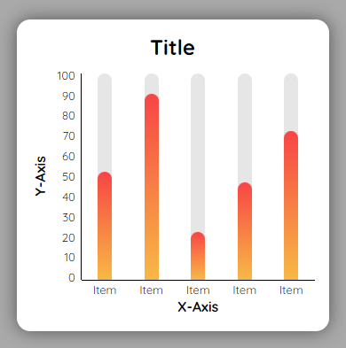

# Barchart Component Integration

The barchart has the following parameters:

- values - array of number
- labels (optional) - array of string
- title (optional) - string
- yAxisLabel (optional) - string
- xAxisLabel (optional) - string

#### Figure 1 - Example of default component

```
<BarChart
  title={'Title'}
  yAxisLabel={'Y-Axis'}
  xAxisLabel={'X-Axis'}
  values={[52, 90, 23, 47, 72]}
  labels={['Item', 'Item', 'Item', 'Item', 'Item']}
/>
```



# Demo

Click the following link for a demo:

There is a form to change the details of the bar chart. Make sure that the values and labels are seperated by a comma as shown in the default graph.
